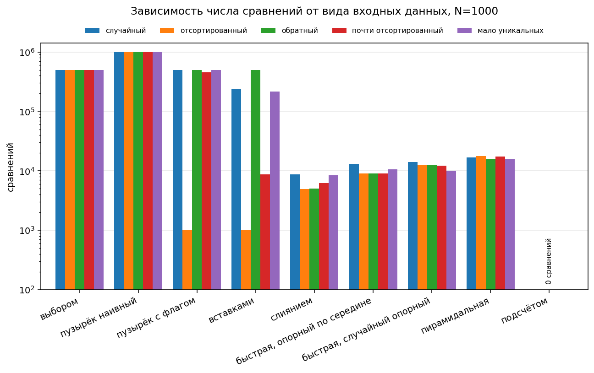
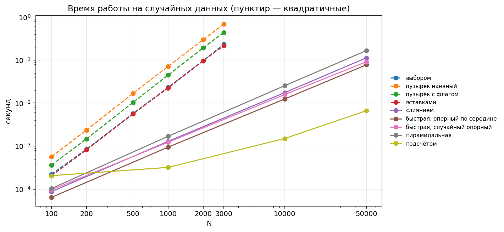
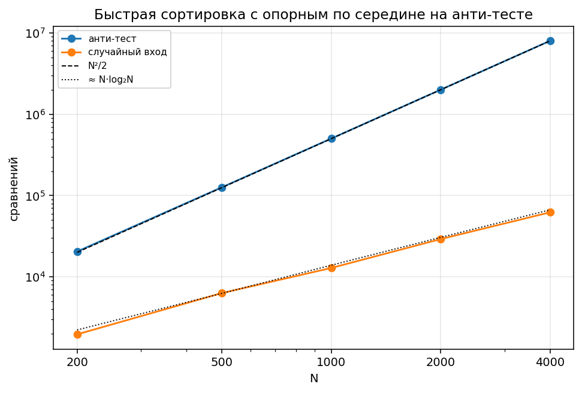
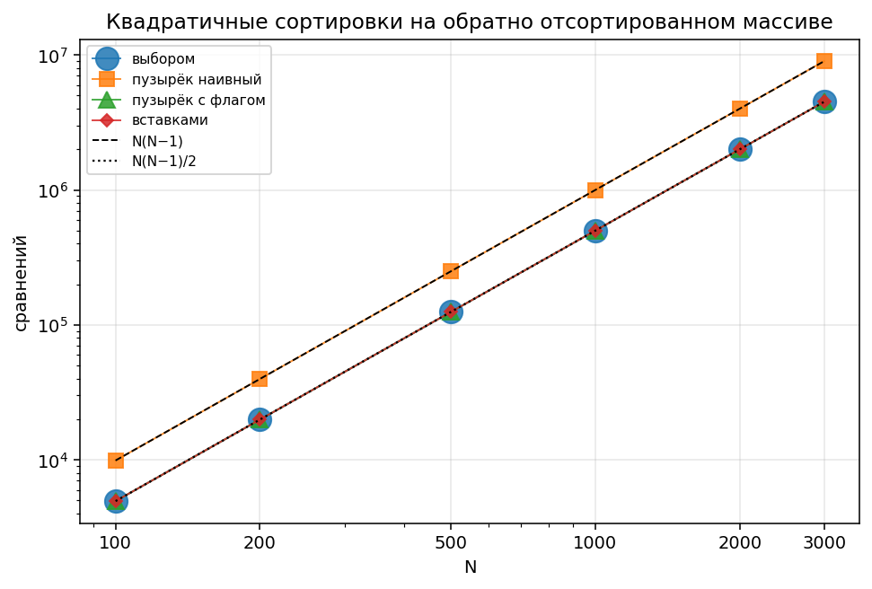

# Лабораторная работа 1. Реализация методов внутренней сортировки. Исследование эффективности программ

## Условие

Тема 1 «Сортировки» курса [АиСД_РГРТУ](https://informatics.msk.ru/course/view.php?id=5956) на informatics. Ограничения: 1 секунда, 64 MiB. Для допуска к лабораторной работе нужно сдать все обязательные задачи, каждую на указанном языке.

| № | Задача | Язык | Что требуется |
|---|---|---|---|
| 111156 | Сортировка выбором | Си++ | функция `SelectionSort(A)`, вывод по невозрастанию |
| 111157 | Сортировка вставкой | Си++ | функция `InsertionSort(A)`, без дополнительного массива |
| 111158 | Сортировка пузырьком | Си++ | функция `BubbleSort(A)`, по невозрастанию, без дополнительного массива |
| 1411 | Сортировка пузырьком | Си++ | посчитать число обменов, N ≤ 1000 |
| 766 | Сортировка слиянием | Python | N ≤ 10⁵ |
| 733 | Быстрая сортировка | Python | N ≤ 10⁵ |
| 111166 | Сортировка подсчетом | Си++ | значения 0..100, строго O(n), встроенные сортировки запрещены |
| 325 | Сортировка точек | Python | по возрастанию расстояния от начала координат, структура `Point`, n ≤ 100 |

Дополнительные задачи, по желанию, язык любой:

| № | Задача | Идея решения |
|---|---|---|
| 1406 | Анаграммы | подсчёт частот символов за O(n), сортировки запрещены |
| 411 | Число | сортировка компаратором: `x` идёт перед `y`, если `xy > yx` |
| 665 | Анти-QuickSort | построить худший вход для опорного по середине |
| 111162 | Такси | неравенство о перестановках: расстояния по возрастанию против тарифов по убыванию |

Вторая часть работы, исследование эффективности, в контест не сдаётся и разобрана ниже.

## Решения задач

Все решения в `contest/`, по одному файлу на задачу.

| Задача | Файл | Приём |
|---|---|---|
| A. 111156 Сортировка выбором | [A_111156_selection_sort.cpp](contest/A_111156_selection_sort.cpp) | на i-м шаге ищем максимум в хвосте и меняем с `a[i]` |
| B. 111157 Сортировка вставкой | [B_111157_insertion_sort.cpp](contest/B_111157_insertion_sort.cpp) | сдвиг хвоста вместо обменов, дополнительный массив не нужен |
| C. 111158 Сортировка пузырьком | [C_111158_bubble_sort.cpp](contest/C_111158_bubble_sort.cpp) | проходы с флагом раннего выхода, по невозрастанию |
| D. 1411 Число обменов | [D_1411_bubble_swaps.cpp](contest/D_1411_bubble_swaps.cpp) | прямая симуляция: при n ≤ 1000 это миллион операций |
| E. 766 Сортировка слиянием | [E_766_merge_sort.py](contest/E_766_merge_sort.py) | восходящее слияние без рекурсии |
| F. 733 Быстрая сортировка | [F_733_quick_sort.py](contest/F_733_quick_sort.py) | разбиение Хоара, случайный опорный, стек вместо рекурсии |
| G. 111166 Сортировка подсчётом | [G_111166_counting_sort.cpp](contest/G_111166_counting_sort.cpp) | массив счётчиков на 101 ячейку, сравнений нет вообще |
| H. 325 Сортировка точек | [H_325_sort_points.py](contest/H_325_sort_points.py) | `dataclass Point`, ключ сортировки — квадрат расстояния |
| I. 1406 Анаграммы | [I_1406_anagrams.py](contest/I_1406_anagrams.py) | сравнение частот символов за O(n) |
| J. 411 Число | [J_411_max_number.py](contest/J_411_max_number.py) | компаратор: `x` раньше `y`, если `xy > yx` |
| K. 665 Анти-QuickSort | [K_665_anti_quicksort.py](contest/K_665_anti_quicksort.py) | см. ниже |
| L. 111162 Такси | [L_111162_taxi.py](contest/L_111162_taxi.py) | неравенство о перестановках |

Проверка запускается скриптом [check_samples.py](contest/check_samples.py): примеры из условий, крайние случаи и предельные размеры. Быстрая сортировка отдельно прогнана на отсортированном, обратном, полностью одинаковом и сильно повторяющемся входе по 10⁵ элементов, везде 0,13 секунды при лимите в секунду.

### Про «Анти-QuickSort»

Широко известная конструкция для этой задачи такая: взять массив 1..n и для каждого `i` от 2 до n поменять местами `a[i]` и `a[(i+1)/2]`. Она даёт почти худший вход, но полный перебор показывает, что до максимума ей не хватает ровно одного сравнения, и так при любом n.

| n | максимум перебором | известная конструкция |
|---|---|---|
| 4 | 12 | 11 |
| 5 | 19 | 18 |
| 6 | 27 | 26 |
| 7 | 36 | 35 |
| 8 | 46 | 45 |

Сравнение оптимальных перестановок с этой конструкцией показало, что они отличаются перестановкой значений 1 и 3. С этой поправкой конструкция даёт ровно максимум, что проверено полным перебором для всех n до 10. Отдельно обрабатывается n = 2, где ответ это тождественная перестановка.

## Что реализовано

Девять алгоритмов в `research/sorts.py`. Каждый ведёт счётчик сравнений и присваиваний, обмен двух элементов считается за три присваивания, как принято в лекции.

| алгоритм | сложность | память | устойчивость |
|---|---|---|---|
| сортировка выбором | O(n²) | O(1) | нет |
| пузырёк наивный | O(n²) | O(1) | да |
| пузырёк с флагом | O(n²), лучший случай O(n) | O(1) | да |
| сортировка вставками | O(n²), лучший случай O(n) | O(1) | да |
| сортировка слиянием | O(n log n) | O(n) | да |
| быстрая, опорный по середине | O(n log n), худший O(n²) | O(log n) | нет |
| быстрая, случайный опорный | O(n log n) в среднем | O(log n) | нет |
| пирамидальная | O(n log n) | O(1) | нет |
| сортировка подсчётом | O(n + k) | O(k) | да |

## Методика замеров

Каждый алгоритм прогоняется на пяти видах входных данных: случайный массив, отсортированный, отсортированный в обратном порядке, почти отсортированный (переставлен 1% элементов) и массив с малым числом уникальных значений. Значения лежат в диапазоне от 0 до 10 000, поэтому сортировка подсчётом применима ко всем профилям.

Квадратичные алгоритмы считаются до N = 3000, остальные до N = 50 000. Время берётся как минимум по нескольким прогонам: 15 при N ≤ 1000, 7 при N ≤ 2000, 5 при больших N.

Первая версия делала один прогон на больших размерах, и время разошлось с числом операций вдвое: на N = 3000 сортировка вставками показала 98 нс на сравнение против 207 нс на N = 2000, чего быть не может. Виновата была посторонняя нагрузка на процессор. Контроль здесь простой: разделить время на число операций и посмотреть, держится ли величина постоянной по строке. После увеличения числа прогонов она держится в пределах 30-50 нс с медленным ростом от кэш-эффектов.

## Результаты

### Сверка с формулами из лекции

Обратно отсортированный массив, N = 1000:

| алгоритм | сравнений | формула | присваиваний | формула |
|---|---|---|---|---|
| пузырёк наивный | 999 000 | N(N−1) = 999 000 | 1 498 374 | 3N(N−1)/2 = 1 498 500 |
| пузырёк с флагом | 499 500 | N(N−1)/2 = 499 500 | 1 498 374 | 3N(N−1)/2 = 1 498 500 |
| сортировка выбором | 499 500 | N(N−1)/2 = 499 500 | 241 225 | 3(N−1)+N(N−1)/2 = 502 497 |
| сортировка вставками | 499 497 | N(N−1)/2 = 499 500 | 501 456 | 3N(N−1)/2 = 1 498 500 |
| сортировка подсчётом | 0 | 0 | 11 994 | N+M = 10 994 |

По сравнениям совпадение точное. Расхождение в три единицы у вставок объясняется данными: в сгенерированном массиве из 1000 элементов только 961 различных, и на равных соседях сравнение обрывает цикл раньше. По той же причине пузырёк недосчитывает 126 присваиваний.

По присваиваниям расхождения содержательные, и их три.

Вставки сдвигом вместо обменов дают вдвое меньше. Формула 3N(N−1)/2 посчитана для варианта, где элемент продвигается к своему месту чередой обменов. Если вместо этого запомнить вставляемый элемент, сдвинуть хвост присваиваниями и положить элемент один раз, получается N(N−1)/2 + 2(N−1) = 501 498, что и наблюдается.

Сортировка выбором на обратно отсортированном массиве не попадает в свой худший случай. Формула предполагает, что минимум обновляется на каждом шаге внутреннего цикла. Так и есть на первом проходе, но после первого же обмена наибольший элемент уезжает в начало необработанной части, и дальше массив уже не убывающий. Обновлений выходит вдвое меньше теоретического максимума.

Сортировка подсчётом расходится потому, что формула N+M учитывает создание массива счётчиков и один проход, а в реализации проходов два: сначала считаем вхождения, потом раскладываем обратно. Отсюда M + 2N вместо M + N.

### Зависимость от вида входных данных

Число сравнений при N = 1000:

| алгоритм | случайный | отсортированный | обратный | почти отсортированный | мало уникальных |
|---|---|---|---|---|---|
| выбором | 499 500 | 499 500 | 499 500 | 499 500 | 499 500 |
| пузырёк наивный | 999 000 | 999 000 | 999 000 | 999 000 | 999 000 |
| пузырёк с флагом | 499 290 | 999 | 499 500 | 454 049 | 495 495 |
| вставками | 238 487 | 999 | 499 497 | 8 691 | 216 455 |
| слиянием | 8 704 | 4 932 | 5 060 | 6 205 | 8 481 |
| быстрая, по середине | 13 213 | 9 091 | 9 096 | 9 091 | 10 582 |
| быстрая, случайный опорный | 14 151 | 12 460 | 12 467 | 12 244 | 10 017 |
| пирамидальная | 16 850 | 17 575 | 15 965 | 17 541 | 15 893 |
| подсчётом | 0 | 0 | 0 | 0 | 0 |



Сортировка выбором и наивный пузырёк дают одно и то же число сравнений на любых данных: их циклы не зависят от значений. Один флаг меняет картину полностью, на отсортированном массиве пузырёк делает 999 сравнений вместо 999 000, в пятьсот раз меньше. На обратном порядке флаг не спасает.

Вставки на почти отсортированных данных дают 8 691 сравнение против 238 487 на случайных. Это того же порядка, что у сортировки слиянием с её 6 205, и наглядно показывает, зачем квадратичный алгоритм держат в стандартных библиотеках для коротких и почти упорядоченных участков.

Быстрая сортировка с опорным по середине на отсортированном входе работает лучше, чем на случайном: 9 091 против 13 213. Распространённое утверждение, что quicksort умирает на отсортированном массиве, относится к выбору опорного с краю. Со срединным опорным нужен специально построенный тест, о нём ниже.

### Время работы



Пунктиром показаны квадратичные алгоритмы, их наклон на логарифмических осях вдвое круче.

Отдельно стоит сортировка подсчётом. При N = 100 она медленнее сортировки слиянием, потому что тратит время на создание массива счётчиков длины 10 001 независимо от размера входа. Линейность по N начинает окупаться примерно с N = 500. Это ровно тот случай, когда асимптотика O(n+k) вводит в заблуждение, если k на два порядка больше n.

### Деградация быстрой сортировки

Дополнительная задача K, «Анти-QuickSort» (665), просит построить перестановку, на которой быстрая сортировка со срединным опорным сделает наибольшее число сравнений. Генератор лежит в `research/generators.py`, проверка на своей же реализации:

| N | случайный вход | анти-тест | N²/2 |
|---|---|---|---|
| 200 | 1 961 | 20 492 | 20 000 |
| 500 | 6 311 | 126 242 | 125 000 |
| 1000 | 12 857 | 502 492 | 500 000 |
| 2000 | 29 143 | 2 004 992 | 2 000 000 |
| 4000 | 62 176 | 8 009 992 | 8 000 000 |



На анти-тесте кривая ложится на N²/2 с точностью до долей процента, то есть алгоритм деградирует ровно до квадрата. При N = 4000 разрыв со случайным входом составляет 129 раз.



На последнем графике маркеры трёх алгоритмов вложены друг в друга: выбор, пузырёк с флагом и вставки дают на обратно отсортированном массиве одинаковое число сравнений.

## Выводы

Асимптотика делит алгоритмы на два класса, но внутри класса разброс достигает порядка. Наивный пузырёк проигрывает вставкам вчетверо на случайных данных при одинаковом O(n²).

Чувствительность к виду входных данных важнее константы. Вставки на почти упорядоченном массиве работают за линейное время, сортировка выбором не выигрывает ничего никогда.

Худший случай алгоритма редко совпадает с интуитивно плохим входом. Ни обратно отсортированный массив для сортировки выбором, ни отсортированный для быстрой сортировки со срединным опорным худшими не являются, их приходится строить специально.

## Как запустить

```
cd research
python benchmark.py --out results.csv
python plots.py
```

Замер занимает несколько минут. Графики складываются в `research/plots/`, сырые числа в `research/results.csv`.
